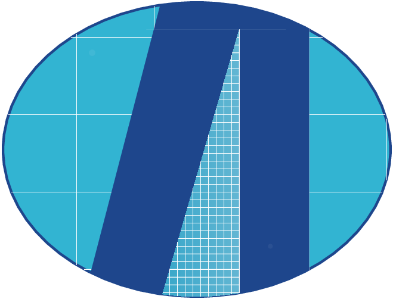

IPSL-AID
========

|PyPI version| |Python versions| |License| |Documentation Status|

**IPSL-AID** is a high-performance research framework for **climate data downscaling**
based on **diffusion models**, designed for **GPU clusters and HPC systems**.

.. |PyPI version| image:: https://img.shields.io/pypi/v/IPSL-AID.svg
   :target: https://pypi.org/project/IPSL-AID/
   :alt: PyPI version

.. |Python versions| image:: https://img.shields.io/pypi/pyversions/IPSL-AID.svg
   :target: https://pypi.org/project/IPSL-AID/
   :alt: Python versions

.. |License| image:: https://img.shields.io/badge/License-Apache_2.0-blue.svg
   :target: LICENSE
   :alt: License

.. |Documentation Status| image:: https://readthedocs.org/projects/ipsl-aid/badge/?version=latest
   :target: https://ipsl-aid.readthedocs.io/en/latest/?badge=latest
   :alt: Documentation Status

Authors
---------------------

- **Kazem Ardaneh**
- **Kishanthan Kingston**

Developed at **IPSL / CNRS / Sorbonne University** (2026)

License
~~~~~~~

This software is licensed under the **Apache License, Version 2.0**.
You may not use this software except in compliance with the License.
You may obtain a copy of the License at:

[http://www.apache.org/licenses/LICENSE-2.0](http://www.apache.org/licenses/LICENSE-2.0)

Unless required by applicable law or agreed to in writing, software distributed under the License is distributed on an "AS IS" BASIS, WITHOUT WARRANTIES OR CONDITIONS OF ANY KIND, either express or implied.

Citation
~~~~~~~~

If you use **IPSL-AID** in your research, please cite:

**IPSL-AID: Generative Diffusion Models for Climate Downscaling from Regional to Global Scales**
Kishanthan Kingston, Olivier Boucher, Freddy Bouchet, Pierre Chapel, Rosemary Eade, Jean-François Lamarque, Redouane Lguensat, 2026.
IPSL / CNRS / Sorbonne University.
