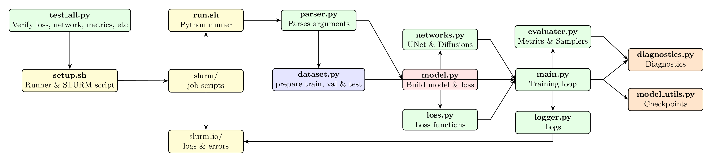

Project Structure
=================

.. code-block:: text

   IPSL-AID/                           # Project root
   ├── pyproject.toml                  # Python project configuration
   ├── setup_diffusion.sh              # Main setup script
   │
   ├── IPSL_AID/                       # Main Python package
   │   ├── __init__.py                 # Package initialization
   │   ├── main.py                     # CLI entry point (training / inference)
   │   ├── dataset.py                  # Data loading and preprocessing
   │   ├── networks.py                 # Diffusion models and UNet-based architectures
   │   ├── model.py                    # Main model wrapper
   │   ├── model_utils.py              # Model utilities
   │   ├── loss.py                     # Loss functions
   │   ├── logger.py                   # Logging and monitoring
   │   ├── utils.py                    # Shared utilities
   │   ├── diagnostics.py              # Evaluation and visualization
   │   ├── evaluater.py                # Error metrics (Sampler, MAE, RMSE, CRPS, etc.)
   │
   ├── tests/                          # Unit tests
   │   └── test_all.py                 # Comprehensive test suite
   │
   ├── slurm_io/                        # I/O utilities for SLURM
   │   ├── diffusion_model.err          # Error logging utilities
   │   └── diffusion_model.out          # Output logging utilities
   │
   ├── slurm/                          # HPC job scripts
   │   ├── run_<experiment_name>.sh    # Executable run scripts
   │   └── sbatch_diffusion_*.sh       # SLURM submission scripts
   │
   └── outputs/                        # Generated outputs (not in version control)
       └── [experiment_timestamp]/     # Experiment-specific directory
           ├── config.yaml             # Full run configuration
           ├── checkpoints/            # Model checkpoints
           ├── logs/                   # Training logs
           └── results/                # Generated samples and metric evaluations

Key Modules Explained
---------------------

**main.py**
   Command-line interface for training and inference. Handles argument parsing,
   configuration loading, and dispatching to appropriate modes. Supports both
   single-run and batch processing.

**dataset.py**
   Data loading, preprocessing, and augmentation. Implements the random block
   sampling strategy for global training. Handles ERA5 data loading, normalization,
   and batch generation with spatial and temporal conditioning.

**networks.py**
   UNet-based architectures adapted for climate data, including ADM-style UNets
   and conditional variants. Supports multiple attention mechanisms and
   conditioning strategies for spatiotemporal context.

**model.py**
   Main model wrapper that integrates diffusion processes with neural networks.
   Handles training loops, inference procedures, and checkpoint management.
   Supports multiple diffusion formulations through configuration.

**model_utils.py**
   Utilities for model creation, inspection, and management. Includes functions
   for parameter counting, model summarization, and distributed training setup.

**loss.py**
   Implementation of diffusion loss functions including EDM, VP, VE, and iDDPM
   formulations. Contains noise schedulers and weighting schemes for
   stable training.

**logger.py**
   Logging and monitoring utilities. Supports console logging, file logging,
   and optional integration with TensorBoard and Weights & Biases for
   experiment tracking.

**utils.py**
   Shared utilities for configuration management, file operations, tensor
   manipulation, random seeding, timing, and parallel processing.

**diagnostics.py**
   Visualization and analysis tools for evaluating model performance, including
   spatial error maps, PDF comparisons, spectral analysis, and Cartopy-based
   geospatial plotting.

**evaluater.py**
   Computation of evaluation metrics: MAE, RMSE, R², CRPS, KL divergence,
   power spectra, and extreme value statistics. Supports both deterministic
   and probabilistic evaluation.

   Flowchart of IPSL-AID's architecture and data flow.

Data Flow
---------

1. **Input**: Low-resolution climate fields + spatiotemporal context (lat/lon, time, topography)
2. **Preprocessing**: Normalization, random block sampling, augmentation
3. **Diffusion**: Noise addition and denoising process (implemented in model.py)
4. **Network**: UNet processing with multi-scale conditioning
5. **Output**: High-resolution residual fields
6. **Postprocessing**: Addition to coarse-up field, denormalization, quality checks

Configuration Management
------------------------

IPSL-AID uses a hybrid configuration system:

1. **Command-line arguments**: Basic runtime options
2. **Setup script**: Main experiment configuration (``setup``)
3. **Runtime generation**: SLURM scripts and run configurations
4. **Output capture**: Full configuration saved with each experiment

Example configuration generation:

.. code-block:: bash

   # From setup script
   ./setup
   # Generates:
   # - slurm/run_diffusion.sh (executable script)
   # - slurm/sbatch_diffusion_[used_setup].sh (SLURM submission)

Testing Strategy
----------------

The test suite in ``tests/test_all.py`` uses Python's ``unittest`` framework:

.. code-block:: python

   # Run all tests
   python tests/test_all.py

   # Run specific test module
   python tests/test_all.py loss

Tests cover:
- **Unit tests**: Individual functions and classes
- **Integration tests**: Data loading and model initialization
- **Validation tests**: Numerical correctness and stability
- **Performance tests**: Memory usage and speed benchmarks

HPC Integration
---------------

Designed for HPC systems:

1. **SLURM integration**: Automatic job script generation
2. **Multi-GPU support**: Distributed training on 4× NVIDIA A100
3. **Shared storage**: Optimized for parallel filesystems
4. **Resource management**: Configurable memory and time limits

Development Workflow
--------------------

.. code-block:: bash

   # 1. Environment setup
   uv venv --python=python3.11
   source .venv/bin/activate
   uv pip install -r pyproject.toml

   # 2. Configuration
   ./setup  # Edit parameters as needed

   # 3. Testing
   python tests/test_all.py

   # 4. Local debugging (small scale)
   python -m IPSL_AID.main --debug --epochs 2 --batch_size 4

   # 5. HPC submission
   sbatch slurm/sbatch_diffusion_*.sh

   # 6. Analysis
   All outputs saved in results/ for study.
