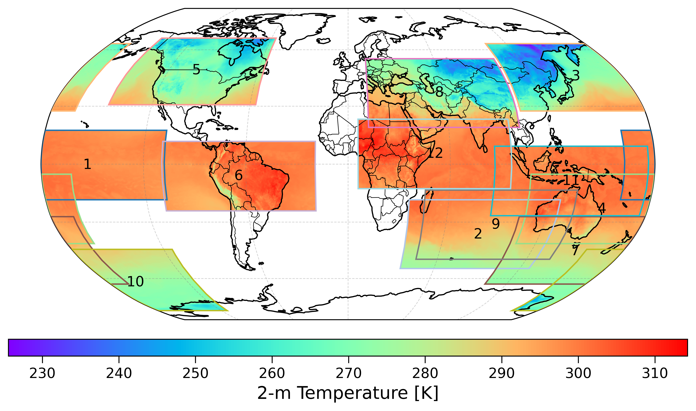

Training Strategy
=================

Training is performed **globally**, using a **random block strategy**:

- Spatial blocks are randomly sampled across the globe
- Enables scalable training on very large climate datasets
- Reduces memory footprint while preserving global coverage
- Improves generalization across regions

This design allows a single model to learn global dynamics while remaining usable
for regional inference.

Random Block Sampling
---------------------

During each training epoch, :math:`s` spatial blocks of size :math:`144\times360`
are generated, with block centers placed randomly. The longitude of each block
is treated as periodic, while the latitude is constrained within valid global
boundaries.

   
   Example of randomly sampled spatial blocks used during training

Several values for the number of spatial blocks per epoch (:math:`s=6`, 9, and 12)
were evaluated, and using 12 blocks was identified as an effective balance
between computational efficiency and spatial diversity.

Coarse-Down-Up Procedure
------------------------

A coarse-down-up procedure based on bilinear interpolation is used to separate
large-scale and fine-scale components:

1. **Coarsen**: High-resolution field :math:`\mathbf{y}^{\mathrm{HR}}` is reduced
   to :math:`16\times32` resolution
2. **Upscale**: Coarse field is scaled back to original resolution, yielding
   :math:`\mathbf{y}^{\mathrm{CU}}`
3. **Residual**: Fine-scale information :math:`\mathbf{R} = \mathbf{y}^{\mathrm{HR}} - \mathbf{y}^{\mathrm{CU}}`
   serves as training target

Conditioning Inputs
-------------------

The model is conditioned on:

1. **Coarse-up fields**: Low-resolution approximations
2. **Geographical variables**: Latitude, longitude, topography (:math:`z`), land-sea mask (LSM)
3. **Temporal information**: Cosine-sine representations of day of year and hour of day

Training Schedule
-----------------

- **Dataset**: ERA5 2015-2019 (train), 2020 (validation), 2021 (test)
- **Batch size**: 80 (optimized for 4× NVIDIA A100 64GB)
- **Epochs**: 100
- **Optimizer**: Adam with learning rate scheduling
- **Validation**: Every epoch on held-out year

Computational Requirements
--------------------------

- **GPUs**: 4× NVIDIA A100 (64 GB each)
- **Time**: ~6 days for full training
- **Memory**: ~200GB GPU memory during training
- **Storage**: Sufficient space for datasets and checkpoints

Hyperparameter Tuning
---------------------

Key hyperparameters:

1. **Learning rate**: Typically :math:`10^{-4}` to :math:`10^{-3}`
2. **Batch size**: Limited by GPU memory, typically 32-128
3. **Block size**: :math:`144\times360` provides good trade-off
4. **Number of blocks**: 12 per epoch for global coverage
5. **Weight decay**: :math:`10^{-6}` for regularization

Monitoring and Logging
----------------------

- **Loss curves**: Training and validation loss
- **Metrics**: MAE, RMSE, R² on validation set
- **Visualizations**: Sample predictions during training
- **Checkpoints**: Save best model and regular intervals

Early Stopping
--------------

Training stops when validation loss doesn't improve for specified number of epochs
(typically 10-20).

Multi-GPU Training
------------------

- **Data Parallel**: Split batches across GPUs
- **Model Parallel**: Split model across GPUs (for very large models)
- **Distributed Data Parallel**: Synchronized gradients across nodes

Reproducibility
---------------

- **Random seeds**: Fixed for reproducibility
- **Configuration saving**: Full config saved with each run
- **Version control**: Code and environment specifications
- **Checkpointing**: Model states saved at regular intervals
