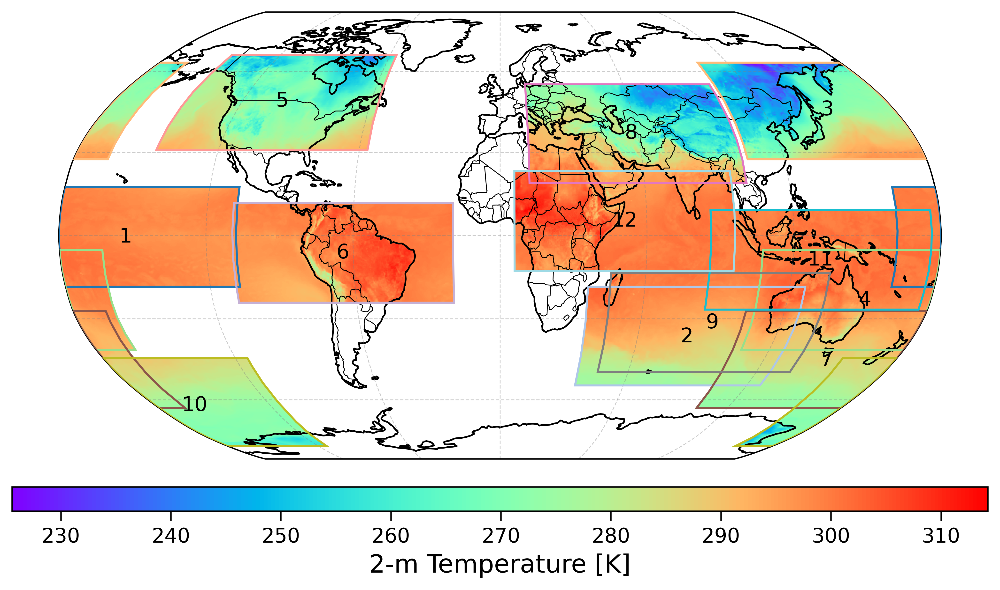
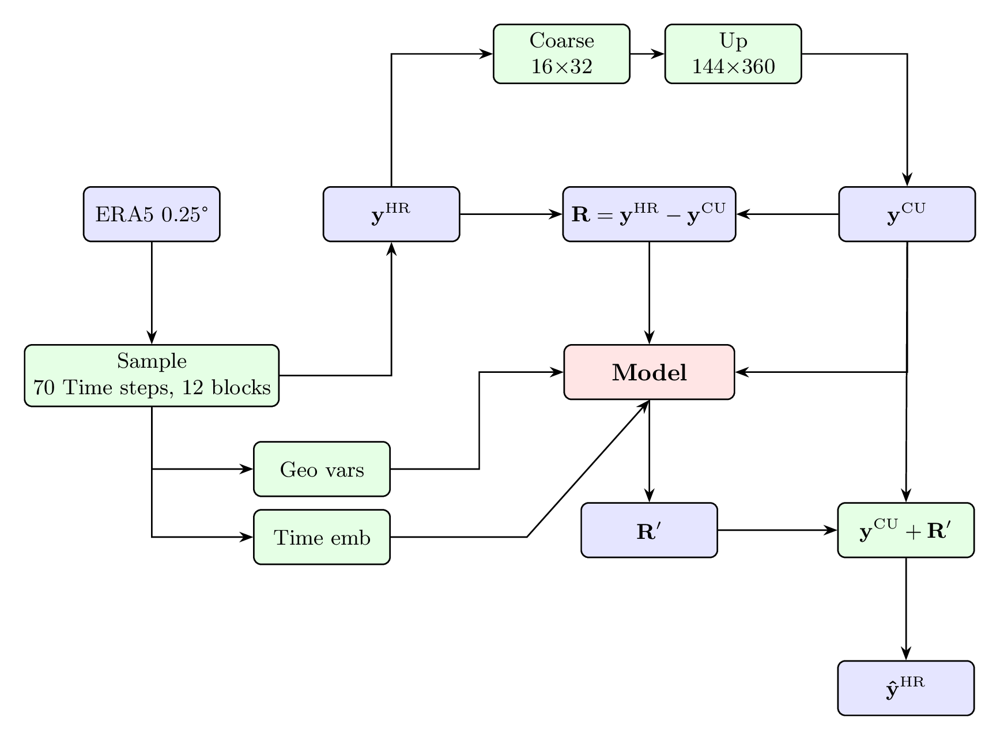

Training Strategy
=================
IPSL-AID can be employed for both **regional** and **global** training.
In the global setting, spatial blocks are drawn freely across the entire
domain, whereas in the regional setting the sampling is constrained so
that every block lies entirely inside one of the user-specified regions.

Random Block Sampling for global training
-----------------------------------------
Training is performed **globally**, using a **random block strategy**:

- Spatial blocks are randomly sampled across the globe
- Enables scalable training on very large climate datasets
- Reduces memory footprint while preserving global coverage
- Improves generalization across regions

This design allows a single model to learn global dynamics while remaining usable
for regional inference.

During each training epoch, :math:`s` spatial blocks of size :math:`144\times360`
are generated, with block centers placed randomly. The longitude of each block
is treated as periodic, while the latitude is constrained within valid global
boundaries.

   Example of randomly sampled spatial blocks used during training

Several values for the number of spatial blocks per epoch (:math:`s=6`, 9, and 12)
were evaluated, and using 12 blocks was identified as an effective balance
between computational efficiency and spatial diversity.

Multi-Region Random Block Sampling
----------------------------------
IPSL-AID model can be trained on several regions simultaneously. In this case,  the random
block sampler is restricted so that **every sampled block lies entirely
inside one of the regions specified by the user**. This prevents the model
from being trained on blocks that straddle the boundary between a region
and its surrounding area, or on blocks that fall in a region that is not
part of the training domain.

The procedure relies on three ingredients:

1. **Global coordinate reference**
   A global latitude/longitude grid (provided through
   ``global_coordinates_file``) defines the reference frame in which
   random centers are drawn.

2. **Per-region validity bounds**
   For each region, the set of *valid block centers* on the global grid is
   precomputed. A center :math:`(i_{\text{lat}}, i_{\text{lon}})` is valid
   for a region if a full block of size
   :math:`({\rm batch_{size}^{lat}, batch_{size}^{lon}})` centered on
   it is entirely contained in that region. These bounds are cached once
   at initialization in ``valid_region_bounds``.

3. **Rejection sampling**
   At each training step, random centers are drawn uniformly on the global
   grid. A center is **accepted only if it belongs to the valid bounds of
   at least one region**, otherwise it is rejected and a new center is
   drawn. The region that contains the accepted center is stored alongside
   it, so that the corresponding regional dataset and its constant
   variables can be retrieved later.

Mathematically, a candidate center :math:`(i_{\text{lat}}, i_{\text{lon}})` is
accepted if there exists a region :math:`r` with valid latitude bounds
:math:`[i_{\text{lat}}^{\min,r}, i_{\text{lat}}^{\max,r}]` and valid
longitude bounds
:math:`[i_{\text{lon}}^{\min,r}, i_{\text{lon}}^{\max,r}]` such that:

.. math::

   i_{\text{lat}}^{\min,r} \;\le\; i_{\text{lat}} \;\le\; i_{\text{lat}}^{\max,r}
   \quad\text{and}\quad
   i_{\text{lon}}^{\min,r} \;\le\; i_{\text{lon}} \;\le\; i_{\text{lon}}^{\max,r}.

If the candidate satisfies this condition, the sampler records both the
global center and the index of the region :math:`r`. The block is then
extracted from the regional dataset associated with :math:`r`, after
mapping the global center back to the regional grid using
``get_center_indices_from_latlon``. This guarantees that:

- the block is spatially consistent with the region it belongs to;
- the correct regional constants (topography, land–sea mask, …) are
  attached to the sample.

Coarse-Down-Up Procedure
------------------------

A coarse-down-up procedure based on bilinear interpolation is used to separate
large-scale and fine-scale components:

1. **Coarsen**: High-resolution field :math:`\mathbf{y}^{\mathrm{HR}}` is reduced
   to :math:`16\times32` resolution
2. **Upscale**: Coarse field is scaled back to original resolution, yielding
   :math:`\mathbf{y}^{\mathrm{CU}}`
3. **Residual**: Fine-scale information :math:`\mathbf{R} = \mathbf{y}^{\mathrm{HR}} - \mathbf{y}^{\mathrm{CU}}`
   serves as training target

Conditioning Inputs
-------------------

The model is conditioned on:

1. **Coarse-up fields**: Low-resolution approximations
2. **Geographical variables**: Latitude, longitude, topography (:math:`z`), land-sea mask (LSM)
3. **Temporal information**: Cosine-sine representations of day of year and hour of day

   Workflow of IPSL-AID's training process.

Training Schedule
-----------------

- **Dataset**: ERA5 2015-2019 (train), 2020 (validation), 2021 (test)
- **Batch size**: 80 (optimized for 4× NVIDIA A100 64GB)
- **Epochs**: 100
- **Optimizer**: Adam with learning rate scheduling
- **Validation**: Every epoch on held-out year

Computational Requirements
--------------------------

- **GPUs**: 4× NVIDIA A100 (64 GB each)
- **Time**: ~6 days for full training
- **Memory**: ~200GB GPU memory during training
- **Storage**: Sufficient space for datasets and checkpoints

Hyperparameter Tuning
---------------------

Key hyperparameters:

1. **Learning rate**: Typically :math:`10^{-4}` to :math:`10^{-3}`
2. **Batch size**: Limited by GPU memory, typically 32-128
3. **Block size**: :math:`144\times360` provides good trade-off
4. **Number of blocks**: 12 per epoch for global coverage
5. **Weight decay**: :math:`10^{-6}` for regularization

Monitoring and Logging
----------------------

- **Loss curves**: Training and validation loss
- **Metrics**: MAE, RMSE, R² on validation set
- **Visualizations**: Sample predictions during training
- **Checkpoints**: Save best model and regular intervals

Early Stopping
--------------

Training stops when validation loss doesn't improve for specified number of epochs
(typically 10-20).

Multi-GPU Training
------------------

- **Data Parallel**: Split batches across GPUs
- **Model Parallel**: Split model across GPUs (for very large models)
- **Distributed Data Parallel**: Synchronized gradients across nodes

Reproducibility
---------------

- **Random seeds**: Fixed for reproducibility
- **Configuration saving**: Full config saved with each run
- **Version control**: Code and environment specifications
- **Checkpointing**: Model states saved at regular intervals
